# infrastructure_grid.py — Pipeline Diagram

## External Dependencies

| Dependency | Type | Purpose | Cost / Key |
|---|---|---|---|
| **OpenStreetMap Overpass API** | REST API | Query POI nodes (schools, transit, restaurants, etc.) within geographic tiles across the continental US | Free, no key — public instance at `overpass-api.de` |
| **NCES Common Core of Data (CCD)** | CSV download | Authoritative K-12 school locations with enrollment counts; supplements OSM which has no capacity data | Free — `nces.ed.gov/ccd/` — manual download, no API key |
| **netCDF4** | Python library | Read population reference grid; write output `.nc` file | `pip install netCDF4` |
| **numpy** | Python library | Array math, z-score normalisation, clamping | `pip install numpy` |
| **requests** | Python library | HTTP POST calls to Overpass API | `pip install requests` |

---

## Full Pipeline Flowchart

```mermaid
flowchart TD

    START([▶ python infrastructure_grid.py]) --> ARGS

    subgraph ARGS["1 · Parse CLI Arguments"]
        A1[/"--output  path/to/maps_infrastructure.nc"\]
        A2[/"--pop-grid  OR  --namelist\nfor lat/lon reference + population"\]
        A3[/"--nces-csv  optional  enrollment-weighted schools"\]
        A4[/"--alpha  default 0.15  WEIGHT spread control"\]
        A5[/"--tile-size  default 5.0°  Overpass tile size"\]
        A6[/"--tile-delay  default 2.0s  pause between tiles"\]
        A7[/"--dry-run  flag"\]
    end

    ARGS --> GRID_SRC

    subgraph GRID_SRC["2 · Resolve Reference Grid and Population"]
        GS1{Source?}
        GS1 -->|"--dry-run only\nno file needed"| GS2["Built-in synthetic\n4×5 grid\n32–44°N, 120–100°W\nno population data"]
        GS1 -->|"--namelist"| GS3["Parse &init_nml block\nread population_mapsgrid_file key"]
        GS1 -->|"--pop-grid"| GS4["Open population\nNetCDF directly"]
        GS3 --> GS5["read_population_grid\nreturns lat, lon, pop array\nMasked values set to 0.0"]
        GS4 --> GS5
        GS2 --> GS5
    end

    GS5 --> MODE

    subgraph MODE["3 · Mode Decision"]
        M1{"--dry-run?"}
    end

    MODE -->|yes| DRYRUN
    MODE -->|no| DEPCHECK

    subgraph DRYRUN["DRY-RUN PATH — no network calls"]
        DR1["make_dry_run_multiplier_grid\nlon-gradient mimics east denser west sparser\nseed=42  Gaussian noise added"]
        DR2["Values clipped to 0.70–1.50\nEastern US slightly above 1.0\nWestern US slightly below 1.0"]
        DR1 --> DR2
    end

    subgraph DEPCHECK["4 · Dependency Check"]
        DC1{"requests\ninstalled?"}
        DC1 -->|no| DC_ERR["EXIT — pip install requests"]
        DC1 -->|yes| TILE
    end

    subgraph TILE["5 · Tile the US Bounding Box"]
        T1["Clip to US extent\n24–50°N, 126–65°W"]
        T2["np.arange in steps of --tile-size\ne.g. 5° → 6 lat bands × 13 lon bands = 78 tiles\ne.g. 10° → 3 × 7 = 21 tiles"]
        T1 --> T2
    end

    TILE --> QUERY

    subgraph QUERY["6 · Query Overpass API — one tile at a time"]
        Q1["Build Overpass QL query\n[out:json][timeout:60]\nUnion of all amenity types\nin INFRA_WEIGHTS dict\nplus EXTRA_OSM_TAGS"]
        Q2["POST to overpass-api.de/api/interpreter\ntimeout=90s per request"]
        Q3{"HTTP success?"}
        Q3 -->|yes| Q4["Extract node elements\nlat, lon, amenity tag\nLook up weight in INFRA_WEIGHTS\nor EXTRA_OSM_TAGS"]
        Q3 -->|no| Q5["Retry up to 3 times\nwith 10s delay between attempts"]
        Q5 -->|3rd failure| Q6["Skip tile silently\nlog warning\ncontinue to next tile"]
        Q4 --> Q7["Append lat, lon, weight tuples\nto all_pois list"]
        Q7 --> Q8["Sleep --tile-delay seconds\nbetween tiles  default 2.0s\nrespects public Overpass rate limits"]
    end

    QUERY --> NCES

    subgraph NCES["7 · Optional NCES School Supplement"]
        NC1{"--nces-csv\nprovided?"}
        NC1 -->|no| NC3["Skip — use OSM\nschool nodes only"]
        NC1 -->|yes| NC2["load_nces_schools\nRead CSV columns:\nLATCOD, LONCOD, MEMBER"]
        NC2 --> NC4["Weight each school by\nenrollment ÷ 1000 × 1.50\nso 1000-student school = 1 OSM node\n2000-student school = 2 OSM nodes"]
        NC4 --> NC5["Append to all_pois\n— these supplement or\nreplace OSM school entries"]
    end

    NC3 --> RASTER
    NC5 --> RASTER

    subgraph RASTER["8 · Rasterise POIs onto MAPS Grid"]
        R1["For each lat, lon, weight in all_pois\nfind nearest grid cell\niy = round  lat − lat0 ÷ dlat\nix = round  lon − lon0 ÷ dlon"]
        R2["Accumulate weight into\nraw_density[iy, ix]\nOut-of-bounds POIs silently dropped"]
        R1 --> R2
        R2 --> R3["Result: raw_density array\nshape  lat × lon  float64\nUnits: weighted POI count per cell\nhigher = denser infrastructure"]
    end

    RASTER --> PERCAP

    subgraph PERCAP["9 · Per-Capita Normalisation"]
        PC1["Divide raw_density by pop_grid\nper_capita = raw_density ÷ population"]
        PC2["Cells with zero population\nset to NaN and excluded\nfrom statistics — will get 1.0 later"]
        PC1 --> PC2
    end

    PERCAP --> ZSCORE

    subgraph ZSCORE["10 · Z-Score Normalisation — compute_infra_multiplier"]
        Z1["Compute mean and std\nacross all populated cells only"]
        Z2{"std < 1e-12?\nall cells identical"}
        Z2 -->|yes| Z3["Return flat 1.0 grid\nno variation to normalise"]
        Z2 -->|no| Z4["z = per_capita − mean ÷ std\nfor each populated cell"]
        Z4 --> Z5["multiplier = 1.0 + alpha × z\nWEIGHT — alpha default 0.15\n1 SD above national mean → 1.15\n1 SD below → 0.85"]
        Z5 --> Z6["Zero-population cells\nset back to 1.0  neutral"]
        Z6 --> Z7["Clamp all values\nto 0.70–1.50"]
        Z1 --> Z2
    end

    DRYRUN --> NANFILL
    Z3 --> NANFILL
    Z7 --> NANFILL

    subgraph NANFILL["11 · NaN Safety Pre-fill"]
        N1["Replace any remaining\nNaN or inf with 1.0\nnot 0.0"]
        N2["Prevents the IC pre-processor reader\nfrom zeroing out beta\nfor cells that had no POI data"]
        N1 --> N2
    end

    NANFILL --> WRITE

    subgraph WRITE["12 · Write NetCDF — maps_infrastructure.nc"]
        W1["Dimensions: lat, lon"]
        W2["lat  float64  degrees_north\nlon  float64  degrees_east"]
        W3["infra_multiplier  float32  lat×lon\nzlib compressed\nExactly ONE data variable\nso read_grid_and_var passes its guard"]
        W4["Global attributes\ntitle, source, conventions CF-1.8\nsource records: OSM Overpass + NCES CCD"]
        W1 --> W2 --> W3 --> W4
    end

    WRITE --> APPLY

    subgraph APPLY["13 · Apply to Beta — edit_namelist.py reads this file"]
        AP1["load_spatial_mean reads maps_infrastructure.nc\ncollapses grid to one scalar mean"]
        AP2["apply_infra_to_beta\nnew_beta = base × 1.0 + 0.40 × mean − 1.0\nWEIGHT = 0.40  INFRA_BETA_WEIGHT"]
        AP3["Applied on top of meteo-adjusted beta\nthen passed to Fortran via namelist"]
        AP1 --> AP2 --> AP3
    end

    WRITE --> END([✓ Done])
```



---

## INFRA_WEIGHTS Reference — POI Type Weights

These weights are calibrated from published contact-pattern matrices
(Mossong et al. 2008; Hoang et al. 2019). A weight of **1.0** represents
baseline community contact rate. Higher values indicate settings that
generate more transmission-relevant contacts per unit time.

| OSM Amenity Tag | WEIGHT | Rationale |
|---|:---:|---|
| `school` | **1.50** | Dense sustained child/young-adult contacts; longest daily dwell time |
| `university` | **1.30** | High cross-age-group mixing; large enclosed spaces |
| `bus_station` | **1.20** | High-volume enclosed space; short contacts but very frequent |
| `subway_entrance` | **1.20** | Same dynamics as bus station |
| `community_centre` | **1.00** | Baseline — sustained indoor gathering, mixed demographics |
| `supermarket` | **0.90** | Recurring high-volume visits; brief but repeated exposures |
| `gym` | **0.80** | Sustained exertion elevates aerosol emission; enclosed |
| `library` | **0.80** | Indoor cross-demographic mixing; lower density than schools |
| `place_of_worship` | **0.70** | High-density but typically brief; once-weekly pattern |
| `restaurant` | **0.60** | Indoor dining, moderate dwell; smaller groups |
| `hospital` | **0.50** | Partially covered by the existing MAPS baseline; some isolation |
| `fast_food` | **0.40** | Shorter dwell than full-service dining; higher turnover |

**Extra OSM tags also queried:**

| Key=Value | WEIGHT |
|---|:---:|
| `shop=supermarket` | 0.90 |
| `leisure=fitness_centre` | 0.80 |
| `public_transport=stop_position` | 1.00 |

---

## Notes on Non-Intuitive Steps

### Why tile the Overpass queries instead of one big request?
The public Overpass API enforces a 60-second server-side timeout. A single query covering the entire continental US (126°W to 65°W, 24°N to 50°N) would return hundreds of thousands of nodes and reliably time out. Splitting into smaller tiles (5° or 10° squares) keeps each query fast and within the timeout. The 2-second delay between tiles respects the public server's fair-use policy.

### Why use NCES data on top of OSM schools?
OSM school nodes are just geographic points — they carry no information about how many students attend. A rural one-room schoolhouse and a 3,000-student suburban high school both appear as identical dots. The NCES Common Core of Data CSV provides actual enrollment figures for every K-12 school in the US, allowing schools to be weighted proportionally by capacity. A school with 2,000 students gets twice the weight of one with 1,000.

### Why divide by population before normalising?
Raw POI counts are higher in cities simply because cities have more of everything. New York City has more schools, restaurants, and transit stops than rural Kansas — but it also has vastly more people. Dividing by population converts "how many venues" into "how many venues per resident," which is the quantity that actually predicts per-person contact rate. A small town dominated by a large university may have higher per-capita school density than a major metro.

### What does the z-score normalization actually do?
After per-capita density is computed, z-score standardisation translates the national distribution into a multiplier centred at exactly 1.0. A cell with average per-capita density gets multiplier 1.0 — no effect on beta. A cell 1 standard deviation above average gets `1.0 + alpha` (default: 1.15). A cell 1 SD below gets `1.0 − alpha` (default: 0.85). This design means the **national average beta is unchanged** — only the spatial distribution shifts, with urban areas above 1.0 and rural areas below.

### Why do zero-population cells get 1.0?
Ocean cells, lakes, and genuinely uninhabited areas have no population to divide by, making per-capita density undefined. Assigning them 1.0 (neutral) means they contribute no artificial signal when the spatial mean is computed in `edit_namelist.py`.

### What does alpha control?
`alpha` is the z-score scaling factor. It sets how far the multiplier stretches away from 1.0 for a given amount of above/below-average infrastructure density:

| alpha | 1 SD above mean | 1 SD below mean |
|:---:|:---:|:---:|
| 0.05 | 1.05 | 0.95 |
| **0.15** (default) | **1.15** | **0.85** |
| 0.30 | 1.30 | 0.70 |

### Why is INFRA_BETA_WEIGHT set lower than METEO_BETA_WEIGHT?
`METEO_BETA_WEIGHT = 0.60` vs `INFRA_BETA_WEIGHT = 0.40`. Infrastructure density is a structural proxy for contact rate — it tells you where people *could* come into contact, not where transmission is actually occurring. Meteorological factors (humidity, temperature, UV) are more directly and repeatedly validated against observed seasonal transmission patterns in the literature (Shaman & Kohn 2009). The lower weight for infrastructure reflects this difference in scientific confidence.

---

## Output File Schema

```
maps_infrastructure.nc         ← static; reused across all forecast cycles
├── Dimensions
│   ├── lat  (n_lat)
│   └── lon  (n_lon)
└── Variables
    ├── lat              float64  (lat,)   degrees_north
    ├── lon              float64  (lon,)   degrees_east
    └── infra_multiplier  float32  (lat, lon)  zlib=True
        ├── long_name  : "dimensionless contact-rate multiplier ..."
        ├── units      : "1"
        └── comment    : "alpha=0.15; range=[0.7, 1.5]"
```

Values > 1.0 → denser-than-average infrastructure (urban/suburban) → higher contact rate
Values < 1.0 → sparser-than-average infrastructure (rural) → lower contact rate
Value = 1.0 → exactly national average — no adjustment to beta
