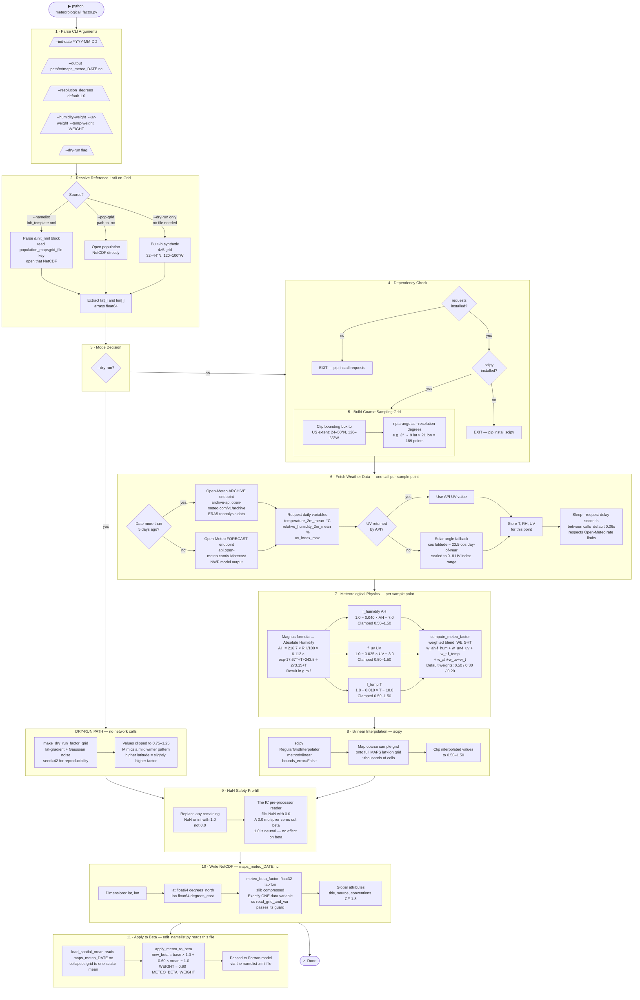

# meteorological_factor.py — Pipeline Diagram

## External Dependencies

| Dependency | Type | Purpose | Cost / Key |
|---|---|---|---|
| **Open-Meteo Archive API** | REST API | Historical ERA5 reanalysis — temperature, RH, UV (dates > 5 days ago) | Free, no key |
| **Open-Meteo Forecast API** | REST API | Near-real-time forecast — same variables (dates within last 5 days) | Free, no key |
| **scipy** `RegularGridInterpolator` | Python library | Bilinear interpolation from coarse sample grid to full MAPS grid | `pip install scipy` |
| **netCDF4** | Python library | Read population reference grid; write output `.nc` file | `pip install netCDF4` |
| **numpy** | Python library | Array math, Magnus formula, clamping | `pip install numpy` |
| **requests** | Python library | HTTP calls to Open-Meteo | `pip install requests` |
| **MAPS population NetCDF** | Local file | Provides the lat/lon reference grid so the output is pixel-aligned with all other MAPS grids | Produced by the IC pre-processor |

---

## Full Pipeline Flowchart



---

## Notes on Non-Intuitive Steps

### Why absolute humidity instead of relative humidity?
Aerosol survival — how long virus-laden particles stay airborne — depends on the **actual water vapour content** of the air, not how saturated the air is relative to its capacity. Two days can have the same relative humidity but very different absolute humidity if temperatures differ. Cold winter air at 70% RH actually holds far less water vapour than warm summer air at 70% RH. Since aerosol survival drives airborne transmission, absolute humidity is the physically correct variable. The Magnus formula converts temperature + relative humidity into this more meaningful quantity.

### Why sample at coarse resolution and interpolate, rather than querying every MAPS cell?
The MAPS grid can have thousands of cells. Making one API call per cell would take hours and hit rate limits. Instead, we sample at 1–3° spacing (~100–200 points), compute the physics at each sample, then use bilinear interpolation (scipy) to fill in the full fine-resolution grid. This is the same approach used in numerical weather prediction downscaling.

### Why two different Open-Meteo endpoints?
Open-Meteo's ERA5 reanalysis (archive) data has a processing lag of approximately 5 days — recent days are not yet ingested. For dates within that lag window the script automatically switches to the near-real-time forecast endpoint instead. The 5-day threshold is `_ARCHIVE_LAG_DAYS = 5`.

### Why does UV fall back to a solar angle calculation?
The ERA5 reanalysis does not always include a UV index variable, particularly for older dates. The fallback computes a physically reasonable estimate from the cosine of the solar declination angle, which captures the dominant drivers of UV (latitude and season). It is less accurate than a measured or modelled UV value but is far better than defaulting to the neutral reference value for all missing points.

### Why pre-fill NaN with 1.0 and not 0.0?
The `read_grid_and_var()` function in the IC pre-processor replaces NaN/masked values with **0.0** after reading. If a grid cell were 0.0, multiplying it into beta would zero out transmission entirely for that cell — an obviously wrong result. Pre-filling with **1.0** (the neutral multiplier) before writing means the reader's fill has no effect on cells where the API returned no data.

### What do the WEIGHT values mean?
There are two layers of weighting:
- **Sub-factor weights** (`w_ah=0.50, w_uv=0.30, w_t=0.20`): humidity drives 50% of the composite factor, UV drives 30%, temperature 20%. These reflect scientific literature (Shaman & Kohn 2009 emphasises humidity most strongly).
- **Whole-factor attenuation** (`METEO_BETA_WEIGHT=0.60`): even after computing the composite factor, only 60% of its deviation from neutral is applied to beta. This prevents weather from dominating over variant-specific biology. At 0.60, a 10% weather signal raises beta by 6%.

---

## Output File Schema

```
maps_meteo_YYYY-MM-DD.nc
├── Dimensions
│   ├── lat  (n_lat)
│   └── lon  (n_lon)
└── Variables
    ├── lat             float64  (lat,)   degrees_north
    ├── lon             float64  (lon,)   degrees_east
    └── meteo_beta_factor  float32  (lat, lon)  zlib=True
        ├── long_name  : "dimensionless transmission-rate multiplier ..."
        ├── units      : "1"
        └── comment    : "init_date=...; range=[0.5, 1.5]"
```

Values > 1.0 → conditions favour transmission (cold, dry, low UV)
Values < 1.0 → conditions suppress transmission (warm, humid, high UV)
Value = 1.0 → neutral (reference conditions, no effect on beta)
